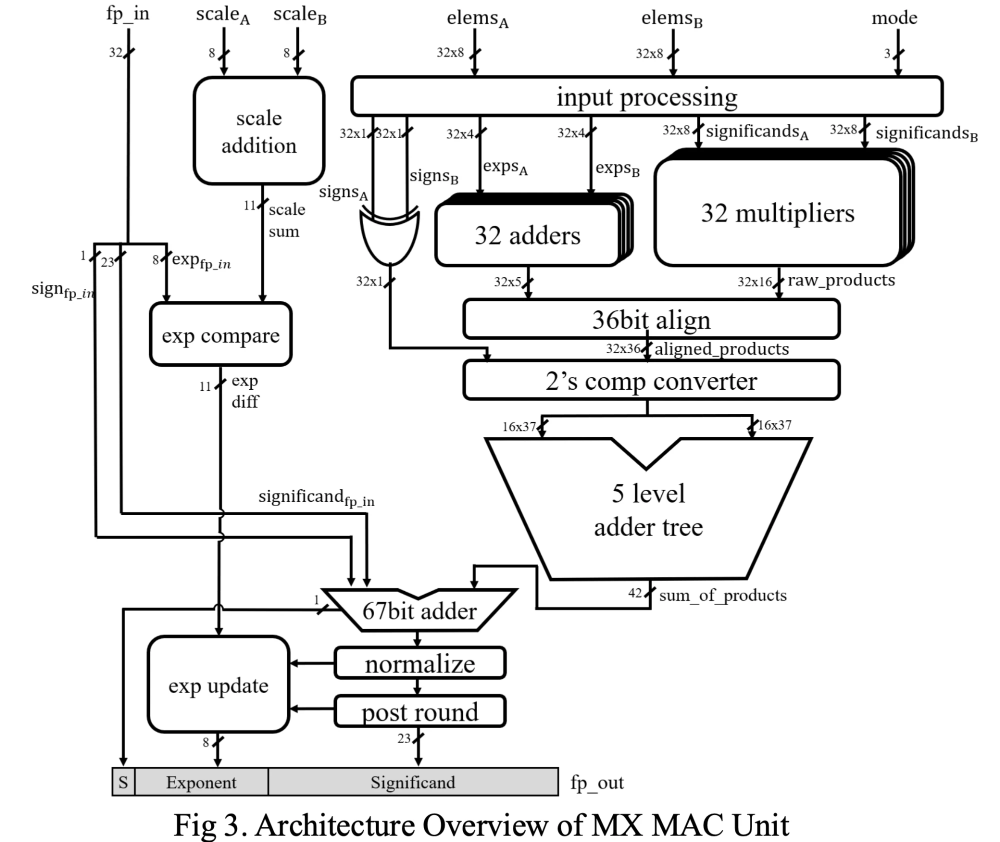

# MXFP MAC: MAC Unit Design for Microscaling (MX) Formats

This repository contains the undergraduate thesis project of **Hongseung Yu** at Seoul National University, advised by Prof. Jae-Joon Kim.

## Overview

[Microscaling (MX)](https://www.opencompute.org/documents/ocp-microscaling-formats-mx-v1-0-spec-final-pdf) is a block floating-point format from the OCP: each block of 32 elements shares one E8M0 scale, and each element keeps its own small exponent. Because of these per-element exponents, MX needs a different MAC design from fixed-point BFP formats.

This project is a Verilog MAC unit for MX formats. It computes the dot product of two 32-element MX blocks, adds the result to an FP32 input, and outputs FP32. It has no accuracy loss along the way.

- **Supported formats** (3-bit `mode`): MXFP8 (E4M3), MXFP6 (E2M3, E3M2), MXFP4 (E2M1), and MXINT8. All formats run on one E4M3 × E4M3 datapath.
- **Exact 36-bit datapath**: the worst case (E4M3 × E4M3) needs (8+8) − (−6−6) + 4 + 4 = 36 bits to hold any product as a fixed-point value.
- **Architecture**: 32 multipliers and exponent adders → 36-bit alignment → two's complement → 5-level adder tree (42-bit sum) → 67-bit adder with the FP32 input → barrel-shifter normalization and rounding → FP32 output.

## Results

Both designs were synthesized with Synopsys Design Compiler on Samsung 28nm CMOS at a 2 ns clock period. The baseline is an FP32 MAC with the same input and output ports.

| | FP32 baseline | MXFP MAC |
|---|---:|---:|
| Area (µm²) | 45,343.93 | **24,585.79** (−46%) |
| Power (µW) | 4.75 | **2.77** (−42%) |
| Pipeline stages | 6 | **4** |

## Repository structure

| Path | Contents |
|---|---|
| `rtl/` | Verilog sources (`mxmac_pipelined.v` is the top module) |
| `tb/` | Testbenches |
| `utils/` | Python test-vector generator and FP32 reference model |
